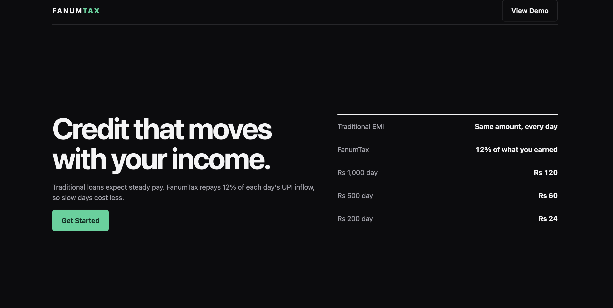
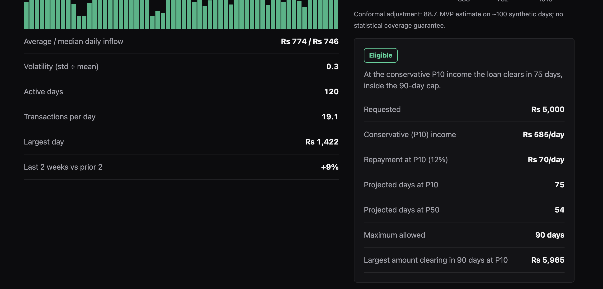
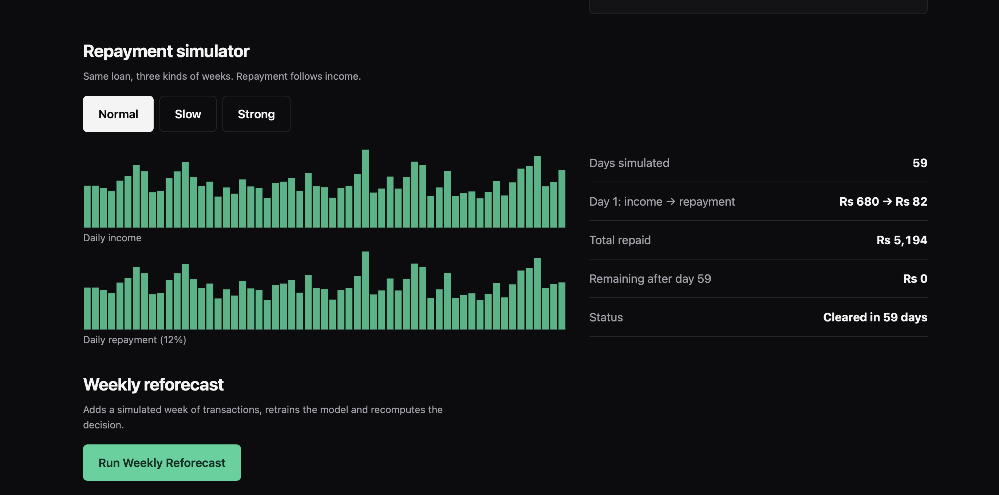
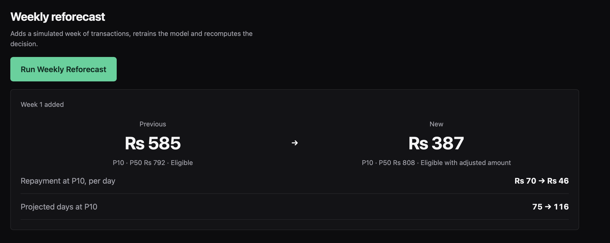
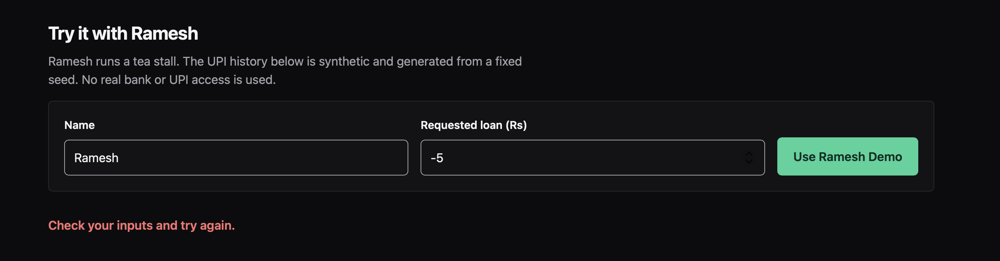
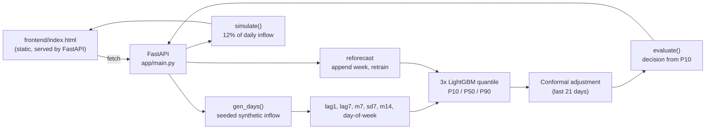

# FANUMTAX

**Credit that moves with your income.**

FanumTax is a hackathon prototype for informal workers (street vendors, gig workers) who have steady UPI activity but no bureau credit history. Instead of a fixed EMI, repayment is a **capped percentage of each day's UPI inflow**, and affordability is judged on a **conservative income forecast (P10)**, not the average.

> **Prototype only.** FanumTax does not provide regulated lending or financial advice. All data is synthetic. No real UPI, bank, or credential access exists anywhere in the code.


---

## Contents

1. [Problem and core idea](#1-problem-and-core-idea)
2. [What is implemented, and what is not](#2-what-is-implemented-and-what-is-not)
3. [Product walkthrough (with screenshots)](#3-product-walkthrough-with-screenshots)
4. [How it works](#4-how-it-works)
5. [API](#5-api)
6. [Synthetic data](#6-synthetic-data)
7. [Run locally](#7-run-locally)
8. [Tests](#8-tests)
9. [Project structure](#9-project-structure)
10. [Design notes](#10-design-notes)
11. [Known limitations and observed behaviour](#11-known-limitations-and-observed-behaviour)
12. [Assumptions needing verification](#12-assumptions-needing-verification)
13. [Roadmap](#13-roadmap)

---

## 1. Problem and core idea

Informal workers may move substantial money through UPI yet be classed "No Hit" by traditional lenders. Even with credit, a fixed EMI mismatches irregular daily income: one slow week can turn an affordable loan into a missed payment.

Our position is **not** "an alternative credit score". It is:

> **Match the repayment to the income.**

Two engines do the work:

| Engine | What it does |
|---|---|
| **1. Income forecasting** | LightGBM quantile models predict daily income as a range (P10 / P50 / P90). A conformal adjustment widens the range using held-out data. **P10 is used for affordability.** |
| **2. Flexible repayment** | Each day, 12% of inflow goes to repayment, with 24% APR simple interest and a 90-day maximum. Slow day means a smaller payment; strong day means a larger one. |

Flexible repayment reduces pressure on slow days. **It does not eliminate default risk**, and the app shows a case where a loan is not cleared in time (see [Slow week](#slow-week)).

---

## 2. What is implemented, and what is not

This repository is a **core slice**: the two engines plus a working UI and tests. Everything marked "Implemented" runs and is exercised by the app or tests.

| Area | Status | Notes |
|---|---|---|
| Synthetic daily UPI inflow generator | ✅ Implemented | Seeded, weekly seasonality, log-normal noise, slow periods |
| Transaction analysis (avg, median, volatility, active days, txns/day, largest day, 2-week trend) | ✅ Implemented | Computed from the series with pandas |
| LightGBM quantile forecast (P10/P50/P90) | ✅ Implemented | Three models, `objective="quantile"`, lag and rolling features, day-of-week |
| Conformal adjustment (CQR-style split conformal) | ✅ Implemented, **hand-written, not MAPIE** | Calibrated on the last 21 usable days; no coverage guarantee claimed |
| Flexible repayment maths (12%, 24% APR, 90-day cap) | ✅ Implemented | Closed-form duration plus day-by-day simulation |
| Loan decision (4 states) with reasons | ✅ Implemented | Driven by P10; nothing hard-coded |
| Repayment simulator (normal / slow / strong) | ✅ Implemented | Calls the API |
| Weekly reforecast (append week, retrain, compare) | ✅ Implemented | Simulated data; shows previous → new |
| Input validation and error states | ✅ Implemented | Pydantic (422), 400/404 with messages, UI error line, loading skeleton |
| Responsive layout, light/dark, reduced-motion | ✅ Implemented | Checked at 1360px and 390px; no horizontal overflow on mobile |
| Automated tests | ✅ 6 passing | See [Tests](#8-tests) |
| FanumTax Trust Score | ❌ Not built | |
| SHAP explanations / LLM explanation layer | ❌ Not built | `.env.example` reserves a key name only |
| NetworkX payer–payee risk graph | ❌ Not built | |
| Fairlearn fairness audit | ❌ Not built | |
| MLflow tracking | ❌ Not built | |
| SQLite persistence | ❌ Not built | State is in memory, single demo user |
| Docker / docker-compose | ❌ Not built | |
| Onboarding form with upload / occupation / category | ❌ Not built | Only name and amount; data is the generated demo series |
| Transaction-level schema (payer, payee, category…) | ❌ Not built | Generator produces **daily aggregates** only |
| React + Tailwind build | ❌ Not built | Single static HTML file with inline CSS/JS and SVG charts |
| MAPIE | ❌ Not used | Conformal step is implemented manually |

The gaps are listed deliberately so nothing is claimed that the code does not do.

---

## 3. Product walkthrough (with screenshots)

All screenshots were captured from the running app against the real API (seed 42, loan ₹5,000).

### Step 1: Landing

Headline, one-sentence explanation, **Get Started** and **View Demo** (both scroll to the demo), and a static comparison of what a ₹1,000 / ₹500 / ₹200 day costs under the 12% rule (₹120 / ₹60 / ₹24).


### Step 2: "Use Ramesh Demo"

Enter a name and requested amount (validated server-side: > 0 and ≤ ₹50,000), then click **Use Ramesh Demo**. A loading skeleton shows while the backend generates the series, trains three LightGBM models and evaluates the loan.

### Steps 3 and 4: Transaction analysis and income forecast

Left: the last 60 days of daily UPI inflow (weekends higher; dips are slow periods) plus summary statistics. Right: the forecast range and the decision panel.



For the default seed the real output is:

| Metric | Value |
|---|---|
| Average / median daily inflow | ₹774 / ₹746 |
| Volatility (std ÷ mean) | 0.30 |
| Active days | 120 |
| Transactions per day | 19.1 |
| Largest day | ₹1,422 |
| Last 2 weeks vs prior 2 | +9.0% |
| **P10 / P50 / P90** | **₹585 / ₹792 / ₹1,018 per day** |
| Conformal adjustment (qhat) | ₹88.7 |

The range chart marks **P10 in bold**: *"P10 is the conservative estimate used for affordability."* A note under the chart states that this is an MVP estimate with no coverage guarantee.

### Steps 6 and 7: Loan structure and decision

The decision panel is computed by `engine.evaluate()`. For ₹5,000 at P10 = ₹585:

| Line | Value |
|---|---|
| Repayment at P10 (12%) | ₹70.2 / day |
| Projected days at P10 | 75 |
| Projected days at P50 | 54 |
| Maximum allowed | 90 days |
| Largest amount clearing in 90 days at P10 | ₹5,965 |
| **Result** | **Eligible** |

**It is not hard-coded.** Change the amount and the result changes. Requesting ₹20,000 gives **Eligible with adjusted amount**, with the reason and the largest amount that would clear:



Possible states, in order of evaluation:

| State | Condition |
|---|---|
| Eligible | Clears within 90 days at **P10** income |
| Eligible with adjusted amount | Does not clear at P10, but a safe amount ≥ ₹1,000 exists |
| Needs review | Clears only at the expected (P50) income |
| Not eligible | Does not clear even at P50 |

### Step 8: Repayment simulator

Three tabs simulate a 90-day window for the same loan. Income and repayment are charted one above the other, with a summary on the right. This is the core demo moment: **low income → lower repayment, high income → higher repayment.**

**Normal week** (clears in 59 days, total repaid ₹5,194):


<a id="slow-week"></a>

**Slow week** (income ×0.55; Day 1: ₹374 income → ₹45 repayment; ₹914 still outstanding at day 90):


**Strong week** (income ×1.4; Day 1: ₹952 → ₹114; clears in 42 days):



The slow scenario **does not clear inside the cap**. We show this on purpose: the product reduces pressure on slow days, it does not make default impossible.

### Step 9: Weekly reforecast

**Run Weekly Reforecast** appends a simulated week of transactions, retrains the models, and re-runs the decision. The panel shows previous → new P10, the status, repayment per day, and projected days.



Verified output from a fresh run (₹5,000 request):

| Week | P10 | P50 | P90 | Status | Days at P10 | Largest safe amount |
|---|---|---|---|---|---|---|
| 0 (initial) | 585 | 792 | 1,018 | Eligible | 75 | ₹5,965 |
| 1 (slow week) | 387 | 808 | 1,132 | Eligible with adjusted amount | 116 | ₹3,946 |
| 2 (strong week) | 445 | 727 | 1,112 | Eligible with adjusted amount | 100 | ₹4,537 |
| 3 (normal week) | 409 | 802 | 1,142 | Eligible with adjusted amount | 109 | ₹4,170 |

The conservative estimate reacts to a slow week and recovers only partially afterwards. That is the intended behaviour of a P10-based rule, but it also shows how noisy small-sample quantile estimates are (see limitations).

### Error state

Invalid input is rejected by Pydantic (HTTP 422) and surfaced as a readable message; the results area stays hidden.



### Mobile

Single-column layout, full-width controls, no horizontal scroll (checked programmatically at 390px).

| Landing | Results (full page) |
|---|---|
|  |  |

### Dark mode

Follows the system preference via CSS tokens.


Full-page capture of the complete flow: [`docs/screenshots/00-full-page.png`](docs/screenshots/00-full-page.png).

---

## 4. How it works



### 4.1 Forecasting (`engine.forecast`)

* **Features** (all lagged to avoid leakage): yesterday's inflow, inflow 7 days ago, 7-day rolling mean and std, 14-day rolling mean, day of week.
* **Models:** three `LGBMRegressor(objective="quantile")` for α = 0.1, 0.5, 0.9 (small trees: 7 leaves, 120 estimators, fixed `random_state`).
* **Horizon:** a 7-day recursive forecast (each step feeds the P50 back as history), averaged to a per-day P10/P50/P90. Values are floored at 0 and ordered so P10 ≤ P50 ≤ P90.
* Requires at least 40 days of history, otherwise raises an error.

### 4.2 Conformal adjustment

A split-conformal step in the style of **conformalized quantile regression (CQR)**:

1. Hold out the last 21 usable days as a calibration set; train on the rest.
2. Nonconformity score = `max(P10 − actual, actual − P90)`.
3. Take the `0.8 × (1 + 1/n)` quantile of the scores as `qhat`, and widen the interval to `[P10 − qhat, P90 + qhat]`.

**Honesty notes:** this is implemented by hand (MAPIE is **not** used). With about 100 days and 21 calibration points, and with time-series data that violates exchangeability, the interval carries **no formal coverage guarantee**. The UI says so next to the chart.

### 4.3 Flexible repayment (`engine.days_to_repay`, `simulate`)

Configuration: `RATE = 12%`, `APR = 24%`, `MAX_DAYS = 90`, `MIN_LOAN = ₹1,000`.

Simple interest accrues daily. Amount due on day *d* is `P × (1 + APR × d / 365)`. With constant daily income `I`, repayments of `RATE × I` clear the loan when

```
P (1 + APR·d/365) = RATE·I·d     ⇒     d = P / (RATE·I − P·APR/365)
```

If the denominator is ≤ 0 (income too low to even cover interest), the loan **never clears** and the duration is reported as infinite.

The largest principal that clears in exactly 90 days at income `I`:

```
P_max = I · RATE · 90 / (1 + APR · 90 / 365)
```

`simulate()` walks day by day, paying `min(12% × inflow, remaining due)` until the balance is cleared or day 90.

### 4.4 Decision (`engine.evaluate`)

Uses the formulas above at P10 (conservative) and P50 (expected), following the state table in [Steps 6 and 7](#steps-6-and-7-loan-structure-and-decision). It returns the status, a plain-language reason, and every number shown in the panel.

### 4.5 Weekly reforecast (`POST /api/reforecast`)

Generates 7 new days (different seed per week), multiplies them by a rotating factor `[1.0, 0.6, 1.25][week % 3]` so the simulated week drifts, appends them to the history, retrains all three models, and returns previous and current results side by side.

---

## 5. API

Interactive docs are available at <http://localhost:8000/docs> (FastAPI/OpenAPI).

| Method | Path | Purpose |
|---|---|---|
| `POST` | `/api/evaluate` | Body `{"name": str (1–60), "amount": number (>0, ≤50000)}`. Generates Ramesh's data, forecasts, evaluates; resets the reforecast counter. Returns `summary`, `forecast`, `decision`, `history` (last 60 days). |
| `POST` | `/api/reforecast` | Adds a simulated week and returns `{week, previous, current}`. `400` if `/api/evaluate` has not been run. |
| `GET` | `/api/repayment/{kind}` | `kind` is `normal`, `slow` or `strong`. Returns the day-by-day schedule (`day, income, repayment, cumulative, remaining`). `404` for an unknown kind, `400` if not yet evaluated. |

Example:

```bash
curl -s -X POST localhost:8000/api/evaluate \
  -H 'Content-Type: application/json' \
  -d '{"name":"Ramesh","amount":5000}'
```

The endpoint set is smaller than the one originally planned (no `/onboard`, `/trust-score`, `/risk-graph`, `/fairness-audit`, `/explanation`); those belong to the unbuilt modules.

---

## 6. Synthetic data

`engine.gen_days(n=120, seed=42, start="2026-06-01", base=800)`:

* **Base level** ₹800/day for a tea stall.
* **Weekly seasonality** multiplier Mon→Sun `[.85, .80, .85, .90, 1.05, 1.30, 1.25]`.
* **Noise** log-normal (σ = 0.22).
* **Slow periods** up to three windows of 3–5 days at 55% of normal.
* **Transactions per day** ≈ inflow ÷ 45 + Poisson(2).

Fixed seed, so the demo is reproducible. Limitation: this yields **daily aggregates**, not individual transactions with payer/payee/category fields.

---

## 7. Run locally

Requirements: Python 3.10+.

```bash
cd backend
pip install -r requirements.txt
uvicorn app.main:app --port 8000
# open http://localhost:8000
```

FastAPI serves the frontend, so there is no separate frontend build or server. No environment variables are required (`.env.example` is a placeholder only).

Docker is **not** provided in this version.

---

## 8. Tests

```bash
cd backend
python -m pytest
```

Six tests, all passing:

| Test | Covers |
|---|---|
| `test_zero_income_never_repays` | Zero income gives infinite duration |
| `test_days_formula` | Closed-form duration matches the formula |
| `test_low_income_rejected` | Very low income gives "Not eligible" |
| `test_adjusted_amount` | Oversized request gives an adjusted amount below the request |
| `test_low_income_lower_repayment` | Slow scenario repays less per day than normal |
| `test_api_flow` | Evaluate, then P10≤P50≤P90, then reforecast week 1, then invalid amount returns 422 |

**Not yet tested:** negative or invalid transactions, missing days, very high income, forecast pipeline edge cases, and repayment over the 90-day cap in the simulator. Those are worth adding next.

---

## 9. Project structure

```
fanumtax/
├── backend/
│   ├── app/
│   │   ├── main.py        FastAPI app, schemas, endpoints, static frontend mount
│   │   └── engine.py      data generator, forecasting, repayment, decision
│   ├── tests/test_core.py
│   └── requirements.txt
├── frontend/
│   └── index.html         single-file UI (HTML, CSS tokens, vanilla JS, SVG charts)
├── docs/screenshots/      images used in this README
├── .env.example
├── .gitignore
└── README.md
```

---

## 10. Design notes

The UI follows the supplied taste-skill principles where they apply: a single accent colour (emerald) on zinc neutrals, one corner radius, strong type hierarchy with tabular numerals for money, flat rows instead of nested cards, purposeful motion only (button press, loading skeleton), `prefers-reduced-motion` and dark-mode support, keyboard focus rings, and SVG charts with `role="img"` labels and hover titles.

Stated plainly: that skill is written for landing pages and explicitly excludes dashboards and multi-step product UI, so the demo section is a pragmatic single-page adaptation, not a full design-system implementation. Charts are hand-written SVG (no charting library).

---

## 11. Known limitations and observed behaviour

These are real behaviours observed while testing, not hypotheticals.

* **Small sample.** About 100 usable synthetic days. Quantile estimates are noisy; P10 moved from ₹585 to ₹387 after one simulated slow week. No statistical coverage guarantee.
* **Hand-written conformal step**, time-series data, small calibration window.
* **Simulator is scenario-based.** Normal/slow/strong use a separate seeded series (seed 7) scaled by 1.0 / 0.55 / 1.4. It is **not** Ramesh's own history or the forecast, so it will not match the "days at P10" figure (e.g. normal clears in 59 days while P10 projects 75).
* **Bar charts scale to their own maximum**, so the normal and slow income charts look alike in shape; read the numbers on the right for magnitude.
* **Nothing models what happens after day 90** (rollover, extension, collections). The simulator simply stops.
* **Daily aggregates only.** No transaction-level records and no "eligible inflow" filtering (all inflow counts).
* **Reforecast is synthetic** and cycles through a fixed pattern of multipliers.
* **State is in memory**, for one demo user. A server restart resets it; concurrent users would overwrite each other.
* **Generic error message** for invalid input in the UI ("Check your inputs and try again"); the API returns detailed 422 bodies.
* **Currency** is shown as "Rs" in the UI.
* **Test coverage is thin** (see [Tests](#8-tests)).
* **Not a credit score and not a fairness-audited model.** No fairness, fraud or explainability tooling exists yet.

---

## 12. Assumptions needing verification

These are assumptions, **not established facts**, and need legal or market verification before any real use:

* Whether and how variable, daily-percentage repayment can be collected under RBI rules for e-mandates.
* The 24% APR and 12% repayment share (chosen as demo parameters, not market benchmarks).
* Any comparison to competitors or market interest rates.
* Any India-wide statistics about informal workers or "No Hit" borrowers (none are asserted in the app).

---

## 13. Roadmap

Planned, **not built**:

1. Trust Score with a documented, factor-based methodology.
2. SHAP explanations, plus an LLM that only rewrites the model's own factors into plain language and never decides.
3. NetworkX payer–payee graph with rule-based anomaly flags (circular flow, payer concentration, velocity), framed as screening signals.
4. Fairlearn audit on synthetic group data, labelled as a monitoring demo.
5. Transaction-level synthetic data and upload.
6. MLflow tracking, SQLite persistence, Docker, MAPIE for conformal intervals.
7. Broader tests (invalid transactions, missing days, high income, cap edge cases).
8. React/Tailwind front end if the project outgrows a single page.

---

*FanumTax is a hackathon prototype. It is not a lender, a credit bureau, or a source of financial advice.*
